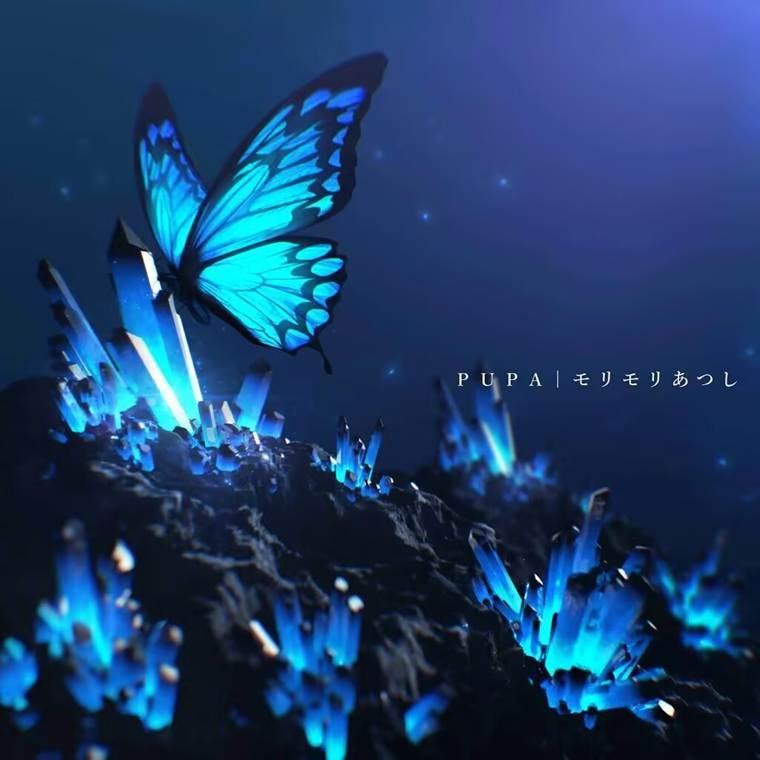

# PUPA

​    我们是徐君翊、张铭轩、蒋宇涵组成的队伍，最终我们决定队名为：蛹（PUPA）。根据我们的理解，这个队名寓意丰富，且大多契合队伍的现状与目标，因此成为最终选择。

​    直接解读蛹这个字，生物学上指的是蝴蝶等昆虫从幼虫到成虫之间的过渡阶段。蛹虽然长期处于静态，但成虫随时破茧的可能性又赋予了他一层动态的爆发力；蛹孤独而脆弱，但不经过如此高风险的状态就无法否定掉先前幼虫的状态，进而羽化成蝶，表明了我们成长的决心。

​    同时，PUPA是首广为人知、被各大音游收录的曲目，由 モリモリあつし 创作，这个作品很好地用音乐诠释了蓝闪蝶（其实为封面中蝴蝶的原型，但画师yoshimo又在翅膀边缘添加了类似凤蝶的花纹使其成为架空品种）蝶变并展翅飞翔的过程。开头由碎拍鼓点引入，仿佛是多角度为蛹进行特写，然后BPM突然走高，插叙了一段蝴蝶飞翔的画面；随后BPM降低进入一段跳拍，其形式因反复而略显平淡，感觉像在细节描写蛹的外貌，体现他局部凌乱但整体有序，也可能是在描绘蛹中的封闭感；之后是一段相对平静的钢琴，好似破茧的前兆，然后情绪突然高亢，这显然不像在描写蛹，我们认为这是转而展现蝴蝶破蛹的短暂过程。后半段是主旋律不断反复、变奏，先是一段灵空的钢琴，然后加入失真吉他，之后BPM、曲调逐渐升高，编曲逐渐复杂化，将歌曲推向最高潮，可以理解为蝴蝶的飞行越来越熟练、有成群结队的同类加入，或者单纯是其心路变化。最后以碎鼓收尾，首尾呼应，象征一个轮回。这首歌曲旋律高雅、节奏新颖、意蕴无穷，每次欣赏都能给予我们动力。

​    Yoshimo同时为PUPA创作了一个MV，表现的是孤傲的蝶之爱，有兴趣可自行观看与解读。

​    Arcaea这款音游将对立的角色设计与曲绘中的蝴蝶联系起来，成为MV立意的延申，赋予了PUPA更深刻的含义。对立的剧情展现了一种可能的人生，那里充满了苦难与丑陋，虽然这十分令人气馁，但对立正是从对痛苦的憎恶中激发了强大的力量、反抗被诅咒的命运。ACM是人生的缩影，路途上可能没那么多苦难与丑陋，也不需要选手拥有强烈的愤怒才能保持前进，但我们希望无论在赛场与训练时碰到什么困难都能斗志不灭，勇克难题。

